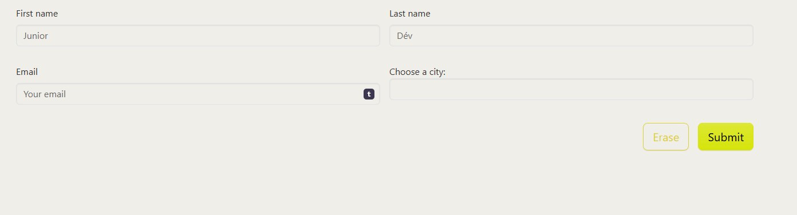

# Client Forms validation

## Context

- créer un page forms-validation.html
- dans le dossier JS créer un partial _validateforms.js
- importer ce js dans main.js
- ajouter le lien de la page html dans la page d'Accueil

## TODO

- dans la page forms-validation créer le `<form>`
- 
- aller à bootstrap validation form documentation et compléter votre form avec les attr html conseillé.

enjoy coding :smile:
