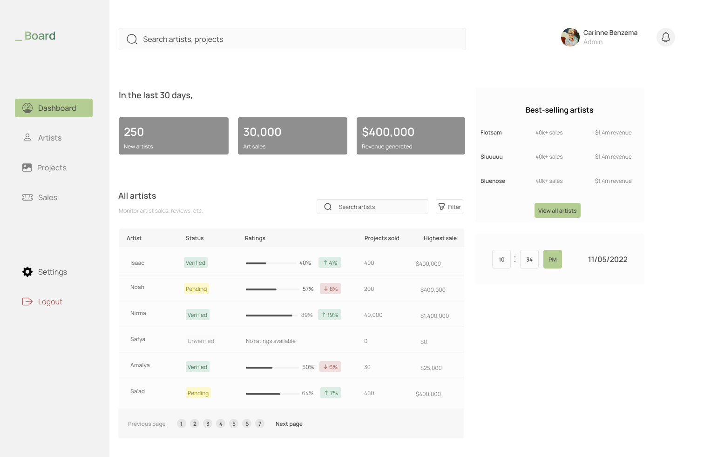
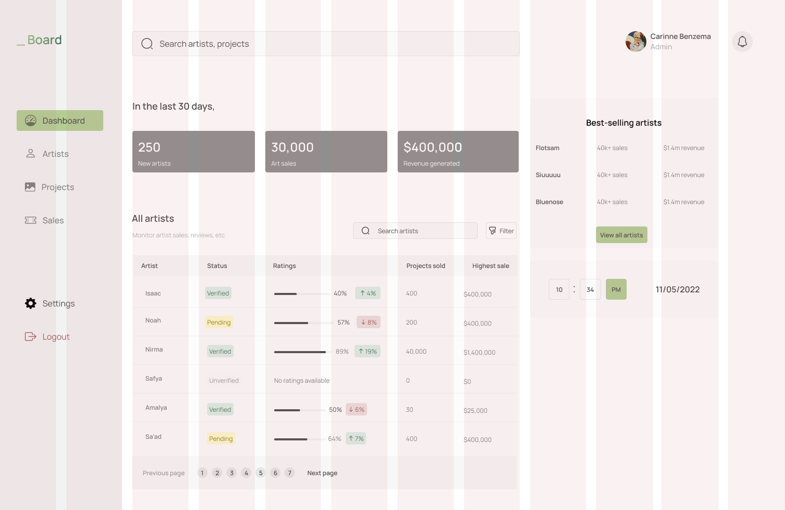
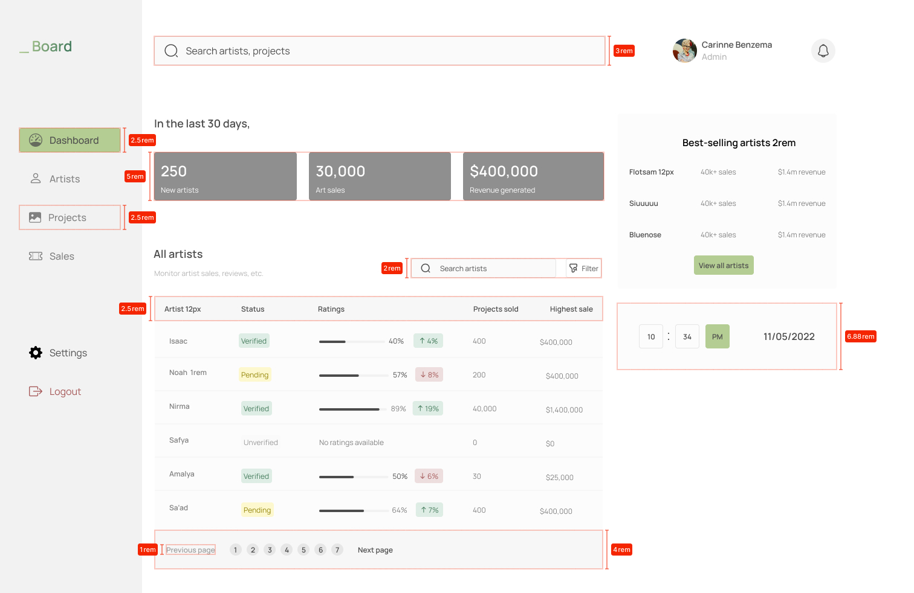

# Exercice BS5

## Projet: Dashboard

container fluid
elements:
- logo
- sidebar
- main
- search bar
- une rangé de trois block (mini card)
- Table DATA:
   - header
   - body line

- pagination
- Block 'Best Selling':
  - title
  - a data line
  - BTN view all
- Block date:
  - Local date and hours

## Files

Happy coding :smile:

repo: [@b3no1t](https://github.com/b3no1t/examples/tree/main/parcel)

